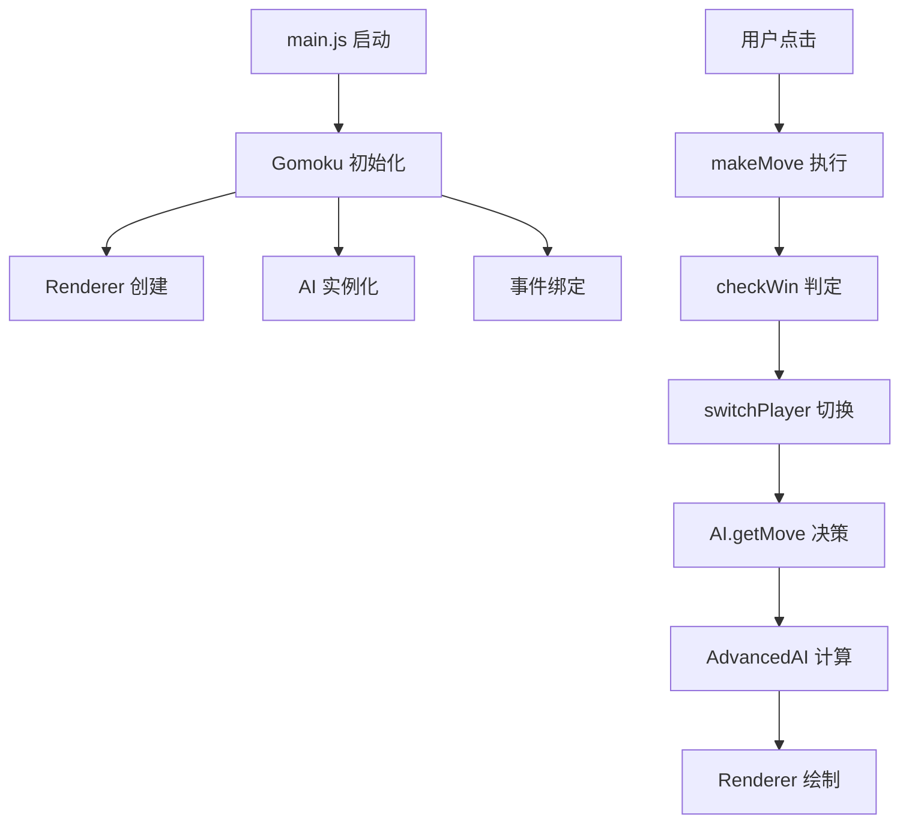

# 🏁 五子棋 AI 系统 - 技术文档

> **项目概述**: 一个基于原生 JavaScript 的网页五子棋游戏，集成了三级难度的智能AI系统，采用模块化架构，支持人机对战。

---

## 📁 1. 文件结构与模块划分

### 1.1 项目目录结构

```
wuziqi/
├── 📁 src/                         # 核心业务逻辑模块
│   ├── 🧠 advanced-ai.js          # 高级AI算法引擎 (49KB, 1529行)
│   ├── 🎮 game.js                 # 游戏主逻辑控制器 (9.6KB, 279行)
│   ├── 🤖 ai.js                   # AI分发器与接口层 (3.3KB, 100行)
│   ├── 🎨 renderer.js             # Canvas渲染引擎 (4.9KB, 148行)
│   └── ⚙️ config.js               # 全局配置常量 (364B, 13行)
├── 🏠 index.html                   # 主页面入口 (2.4KB)
├── 🎨 style.css                    # 样式表 (5.5KB)
├── 🚀 main.js                      # 应用启动入口 (1.2KB)
├── 🧪 test-threat-fixes.html       # 威胁检测测试页面 (25KB)
├── 📜 restart-server.sh            # 服务器脚本
└── 📄 SERVER_SCRIPTS.md            # 服务器文档
```

### 1.2 模块职责划分

| 模块类型 | 文件 | 核心职责 | 复杂度 |
|---------|------|---------|--------|
| **🎮 核心业务** | `game.js` | 游戏状态管理、事件处理、胜负判定 | 中等 |
| **🧠 AI引擎** | `advanced-ai.js` | 威胁分析、搜索算法、策略决策 | 高 |
| **🤖 AI接口** | `ai.js` | 难度分发、实例管理、API封装 | 低 |
| **🎨 渲染层** | `renderer.js` | Canvas绘制、动画效果、UI呈现 | 中等 |
| **⚙️ 配置层** | `config.js` | 常量定义、难度配置、参数管理 | 低 |
| **🚀 启动层** | `main.js` | 应用初始化、事件绑定、入口控制 | 低 |

---

## 🧩 2. 功能模块与关键抽象

### 2.1 系统主要功能

#### 🎯 **核心游戏功能**
- ✅ **标准五子棋对战** - 15×15棋盘，五子连珠获胜
- ✅ **随机先手系统** - 每局随机决定用户或AI执黑先手
- ✅ **人机对战模式** - 支持用户先手和AI先手两种模式
- ✅ **三级难度系统** - 简单/进阶/专业
- ✅ **实时交互** - 鼠标/触摸操作，预览功能
- ✅ **游戏控制** - 重新开始、悔棋、难度切换

#### 🧠 **AI智能功能**
- ✅ **威胁模式识别** - 活四、冲四、活三、跳三等
- ✅ **多重威胁分析** - 双三、双四组合检测
- ✅ **深度搜索算法** - Minimax + Alpha-Beta剪枝
- ✅ **动态策略调整** - 基于难度的参数配置
- ✅ **性能优化** - 置换表缓存、移动排序

### 2.2 关键抽象与类设计

#### 🎮 **Gomoku 类** - 游戏主控制器
```javascript
class Gomoku {
    // 核心状态
    board: Array<Array<number>>     // 棋盘状态矩阵
    currentPlayer: number           // 当前玩家 (1=黑子, 2=白子)
    gameOver: boolean              // 游戏结束标志
    difficulty: string             // AI难度级别
    
    // 核心方法
    makeMove(row, col)             // 执行落子
    checkWin(row, col, player)     // 胜负判定
    switchPlayer()                 // 切换玩家
    changeDifficulty(level)        // 难度调整
}
```

#### 🤖 **AI 类** - AI分发器
```javascript
class AI {
    aiInstances: Map<string, AdvancedAI>  // AI实例缓存池
    
    getMove(difficulty): {row, col}       // 根据难度获取AI走法
    getAIInstance(difficulty): AdvancedAI // 实例工厂方法
}
```

#### 🧠 **AdvancedAI 类** - AI算法引擎 
```javascript
class AdvancedAI {
    // 配置系统
    difficulties: Object           // 三级难度参数配置
    config: Object                // 当前难度配置
    transpositionTable: Map       // 搜索缓存表
    
    // 九层决策系统
    getAdvancedMove()             // 主决策入口
    findWinningMove()             // 1.获胜检测
    findUrgentThreatDefense()     // 2.紧急防守
    findCombinedThreats()         // 3.多重威胁
    findStrategicThreatSetup()    // 4.战略布局
    getAdvancedMinimax()          // 5.深度搜索
    
    // 威胁分析系统
    analyzeThreatAtPosition()     // 位置威胁分析
    detectSpecialThreats()        // 特殊威胁检测
    classifyThreat()              // 威胁分类评估
}
```

#### 🎨 **Renderer 类** - 渲染引擎
```javascript
class Renderer {
    canvas: HTMLCanvasElement     // Canvas画布
    ctx: CanvasRenderingContext2D // 2D渲染上下文
    
    drawBoard(board)              // 绘制棋盘
    drawPieces(board)             // 绘制棋子
    showPreview(row, col, player) // 预览效果
    drawWinLine(winInfo)          // 获胜连线
}
```

### 2.3 模块协同工作机制



---

## 🛠 3. 技术栈与依赖

### 3.1 核心技术栈

| 技术栈类别 | 技术选型 | 版本 | 用途说明 |
|-----------|---------|------|---------|
| **🌐 前端框架** | 原生 JavaScript | ES6+ | 核心业务逻辑，无框架依赖 |
| **🎨 UI渲染** | HTML5 Canvas | 原生API | 棋盘绘制、动画效果 |
| **💅 样式** | CSS3 | 原生 | 响应式布局、动画效果 |
| **📦 模块系统** | ES6 Modules | 原生 | import/export模块化 |
| **🧮 算法引擎** | 原生实现 | 自研 | Minimax、威胁分析算法 |

### 3.2 无外部依赖设计

#### ✅ **零依赖优势**
- 🚀 **加载速度快** - 无需下载额外库文件
- 🛡️ **安全性高** - 无第三方安全风险
- 🔧 **维护简单** - 无版本兼容问题
- 📱 **兼容性好** - 支持所有现代浏览器

#### 🏗️ **自研组件**
- **AI算法引擎** - 完全自主实现的威胁分析和搜索算法
- **Canvas渲染器** - 自研的游戏画面渲染系统
- **事件管理系统** - 原生事件处理机制
- **状态管理** - 简洁的游戏状态管理模式

### 3.3 构建与部署

#### 📦 **开发环境**
- **HTTP服务器**: Python `http.server` / Node.js `http-server`
- **调试工具**: Chrome DevTools, 内置console.log
- **测试环境**: 自研HTML测试页面 (`test-threat-fixes.html`)

#### 🚀 **部署方式**
- **静态部署**: 任何支持静态文件的Web服务器
- **CDN部署**: 所有文件均为静态资源，可直接CDN加速
- **本地运行**: 双击HTML文件即可在浏览器中运行

---

## 🧭 4. 架构与交互流程

### 4.1 系统高层架构

```
┌─────────────────────────────────────────────────────────────┐
│                        🌐 表现层 (Presentation)                │
├─────────────────────────────────────────────────────────────┤
│  index.html    │  style.css    │  main.js                   │
│  用户界面      │  样式定义      │  启动控制                    │
└─────────────────────────────────────────────────────────────┘
                                 ⬇️
┌─────────────────────────────────────────────────────────────┐
│                        🎮 业务层 (Business)                   │
├─────────────────────────────────────────────────────────────┤
│              game.js - 游戏主控制器                          │
│  • 游戏状态管理    • 事件处理    • 胜负判定                   │
│  • 用户交互       • 难度控制    • 生命周期                    │
└─────────────────────────────────────────────────────────────┘
                    ⬇️                          ⬇️
┌─────────────────────────────┐    ┌─────────────────────────────┐
│       🤖 AI智能层            │    │       🎨 渲染层              │
├─────────────────────────────┤    ├─────────────────────────────┤
│  ai.js - AI分发器           │    │  renderer.js - 渲染引擎      │
│  • 难度路由                 │    │  • Canvas绘制               │
│  • 实例管理                 │    │  • 动画效果                 │
│           ⬇️                │    │  • 用户预览                 │
│  advanced-ai.js - AI引擎    │    │                            │
│  • 威胁分析                 │    │                            │
│  • 搜索算法                 │    │                            │
│  • 策略决策                 │    │                            │
└─────────────────────────────┘    └─────────────────────────────┘
                    ⬇️
┌─────────────────────────────────────────────────────────────┐
│                      ⚙️ 配置层 (Configuration)                │
├─────────────────────────────────────────────────────────────┤
│              config.js - 全局配置                            │
│  • 棋盘参数      • 渲染参数      • 难度定义                   │
└─────────────────────────────────────────────────────────────┘
```

### 4.2 核心交互流程

#### 🎯 **游戏启动流程**
```
1. main.js 监听 DOMContentLoaded
2. 创建 Gomoku 实例
3. 初始化 Renderer (Canvas设置)
4. 初始化 AI (实例缓存池)
5. 绑定用户事件 (点击、键盘、触摸)
6. 渲染初始棋盘
7. 等待用户交互
```

#### 🎮 **对战循环流程**
```
用户落子 → 棋盘更新 → 胜负检测 → 切换AI → AI思考 → AI落子 → 重复循环
    ⬇️         ⬇️         ⬇️         ⬇️        ⬇️        ⬇️
makeMove   renderer   checkWin   AI.getMove  算法决策  makeMove
```

#### 🧠 **AI决策流程**
```
AI.getMove(difficulty) 
    ⬇️
根据难度选择算法
    ⬇️
AdvancedAI.getAdvancedMove()
    ⬇️
九层决策系统：
1️⃣ 检查获胜机会
2️⃣ 阻止对手获胜  
3️⃣ 紧急威胁防守
4️⃣ 寻找多重威胁
5️⃣ 多重威胁防守
6️⃣ 强制威胁攻击
7️⃣ 强制威胁防守
8️⃣ 战略威胁布局
9️⃣ Minimax深度搜索
    ⬇️
返回最佳走法 {row, col}
```

### 4.3 模块依赖关系

#### 📦 **依赖层次图**
```
main.js
    └── game.js (Gomoku)
            ├── config.js (配置常量)
            ├── renderer.js (Renderer)
            └── ai.js (AI)
                    └── advanced-ai.js (AdvancedAI)
                            └── config.js (BOARD_SIZE)
```

#### 🔄 **数据流向**
- **向下流**: 用户输入 → 游戏状态 → AI决策 → 渲染输出
- **向上流**: AI分析结果 → 游戏逻辑验证 → 界面更新
- **横向流**: 游戏状态 ↔ 渲染器, AI实例 ↔ 缓存池

### 4.4 性能优化设计

#### ⚡ **AI性能优化**
- **置换表缓存** - 避免重复计算相同局面
- **Alpha-Beta剪枝** - 减少搜索空间
- **移动排序** - 优先搜索有价值的走法
- **动态深度** - 根据局面复杂度调整搜索深度

#### 🎨 **渲染性能优化**
- **按需重绘** - 只在必要时重新绘制Canvas
- **事件节流** - 鼠标移动事件优化
- **预览缓存** - 减少重复绘制操作


---

## 📚 总结

本五子棋AI系统采用**模块化架构**，具有以下特点：

### ✨ **技术优势**
- 🚀 **零依赖设计** - 纯原生JavaScript实现
- 🧠 **智能AI引擎** - 九层决策系统 + 复杂威胁分析  
- 🎨 **流畅用户体验** - Canvas渲染 + 实时交互
- 📦 **模块化架构** - 职责清晰，易于维护扩展
- ⚡ **性能优化** - 多种算法优化技术

### 🎯 **适用场景**
- **教育项目** - AI算法学习和实践
- **游戏开发** - 棋类游戏开发参考
- **算法研究** - 博弈树搜索和评估函数
- **前端实践** - Canvas绘图和交互开发

### 🛣️ **扩展方向**
- 增加更多AI难度级别和算法策略
- 实现联机对战和排行榜系统
- 添加机器学习和神经网络AI
- 支持更多棋类游戏规则变体

该系统为五子棋AI开发提供了完整的工程化解决方案，代码结构清晰，文档完善，便于二次开发和学习研究。

---

*文档版本: v1.0 | 更新时间: 2024年 | 适用代码库: Gomoku AI System* 